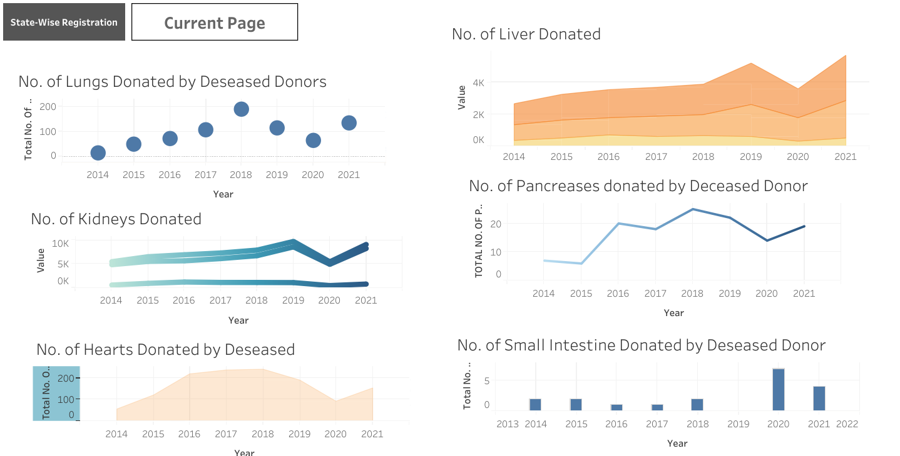
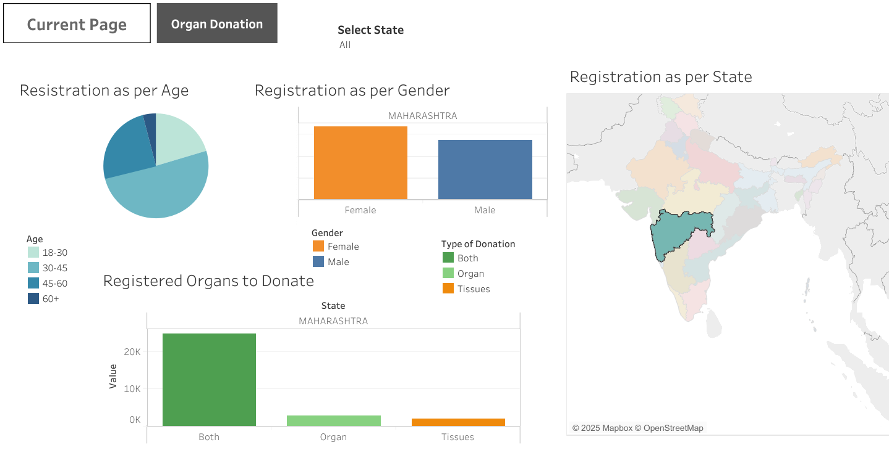

# Organ-Transplant-Analysis
Organ transplant analysis in Tableau involves visualizing donor trends, organ transplant types, and the overall pledges made by Indians to donate organs. The primary transplant types include **kidney, liver, heart, lung, pancreas, and intestine transplants**, along with tissue donations such as **cornea, skin, and bone**. 

In India, organ donation pledges are tracked by the **National Organ and Tissue Transplant Organisation (NOTTO)**. As of In December 2024, the total number of organ donation pledges in India was 483,544, as reported by NOTTO.  

We can use Pandas in Python to analyze data by checking for null values with df.isnull() and exploring attributes using df.describe() for statistical summaries.
Pandas makes it easy to inspect missing values and summarize data quickly. we can handle null values like filling them with mean/median values or dropping rows/columns

Plotly Express is a high-level library in Python designed for quick and easy interactive data visualizations. It simplifies creating complex plots with minimal code. Built on Plotly, it supports a variety of chart types, including scatter plots, bar charts, line graphs, histograms, and choropleth maps.

Lets see how we structuring a Tableau dashboard to visualize this data effectively

### **Key Performance Indicators (KPIs)** 

**1. Number of Donors (Living vs Deceased)**
   - **Living donors**: Individuals who voluntarily donate organs (like kidneys or parts of the liver).
   - **Deceased donors**: Organs retrieved from brain-dead or cardiac-deceased individuals.
   - Tracking donor types helps assess organ availability and donation trends.

**2. Organ Types**
   - Breakdown of **kidney, liver, heart, lung, pancreas, intestine, cornea, skin, bone** donations.
   - Helps analyze the supply-demand gap and focus on critical shortages.

**3. Regional Distribution**
   - Organ transplants and donations categorized by state or hospital.
   - Identifies **high and low donation regions**, guiding awareness campaigns.

### **Process**
**1. Geographic Grouping**
- Segment data by state, region, or specific hospitals.
- Useful for comparing donation rates and healthcare accessibility across areas.
 
**2. Donor Type Classification**
- Separate living vs. deceased donors for understanding contribution dynamics.
- Allows better assessment of voluntary versus emergency donations.

**3. Organ Type Grouping**
- Categorize transplants into kidney, liver, heart, lung, cornea, etc..
- Helps in assessing demand and shortage for specific organs

### **Dashboaeds**

### **Conclusion**
The **Organ Transplant Analysis Dashboard** provides a **data-driven overview** of transplant activities, donor trends, and regional disparities. While **kidney and liver transplants** have grown steadily, the **gap between waiting patients and available organs remains significant**. Living donors contribute heavily, but deceased donations need more awareness and policy support. Some regions outperform others in donor registration and successful transplants, highlighting best practices that could be scaled nationally. Strengthening **donation drives, infrastructure, and organ-matching systems** remains crucial to saving more lives.
